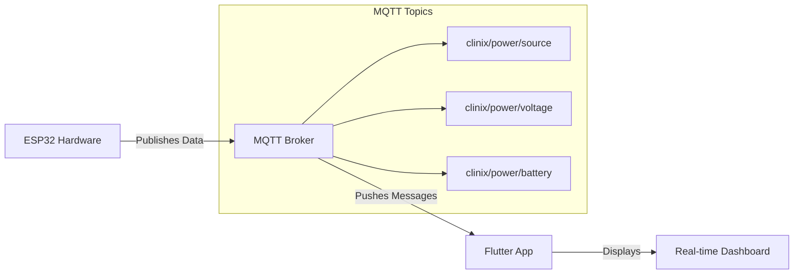

# CliniX Dashboard 

> A Flutter UI for monitoring the CliniX Intelligent Power Management System with real-time MQTT integration.


A responsive Flutter dashboard for the **CliniX** system that now features **real-time MQTT integration**. This application connects to a cloud MQTT broker to display live power source status, voltage metrics, battery levels, and predicted backup time.

## App Demo

Watch the UI showcase with real-time data flow:

<p align="center">
  
</p>

## Screen Gallery

<div align="center">
  <table>
    <tr>
      <td align="center"><strong>Splash Screen</strong></td>
      <td align="center"><strong>Dashboard</strong></td>
      <td align="center"><strong>Battery</strong></td>
      <td align="center"><strong>Log Data</strong></td>
    </tr>
    <tr>
      <td></td>
      <td></td>
      <td></td>
      <td></td>
    </tr>
  </table>
</div>

## Features

- **Real-time MQTT Integration:** Live connection to cloud broker for dynamic data updates
- **Live Voltage Monitoring:** Real-time voltage graph with color-coded status indicators
- **Dynamic Battery Tracking:** Continuously updating battery percentage and backup time calculation
- **Smart Source Switching:** Automatic power source rotation simulation (Grid, Solar, Battery, Generator)
- **Responsive Design:** Adaptive UI that works on mobile, tablet, and desktop
- **Modern Material Design:** Professional teal-themed interface with smooth animations

## Architecture



## Getting Started

### Prerequisites

- **Flutter SDK:** Version 3.13.0 or higher
- **MQTT Broker:** Connected to HiveMQ Cloud (public broker configured)
- **ESP32 Hardware:** Optional for full system integration

### Installation & Running the App

1.  **Navigate to the application directory:**
    ```bash
    cd Application
    ```

2.  **Install the project dependencies:**
    ```bash
    flutter pub get
    ```

3.  **Run the application:**
    ```bash
    # Android device/emulator
    flutter run

    # Web browser
    flutter run -d chrome

    # iOS simulator (macOS only)
    flutter run -d iPhone
    ```

The app will automatically connect to the MQTT broker and start displaying real-time data.

## Project Structure

```bash
Application/
├── lib/
│   ├── main.dart                 
│   └── services/
│       └── mqtt_service.dart     
├── assets/
│   └── clinixicon2.png          
├── media/                       
│   ├── Splash_Screen.png
│   ├── Dashboard.png
│   ├── Battery.png
│   ├── Log_Data.png
│   └── app_demo.gif
├── FLUTTER_README.md
├── pubspec.lock
└── pubspec.yaml                  
```
## MQTT Integration

### Topics Subscribed

| Topic | Data Format | Description | Update Frequency |
|-------|-------------|-------------|------------------|
| `clinix/power/source` | `String` | Current active power source<br>(Grid/Solar/Battery/Generator) | Every 2 seconds |
| `clinix/power/voltage` | `JSON: {"voltage": 220.5, "timestamp": 1701799823}` | Live voltage readings with timestamps | Every 2 seconds |
| `clinix/power/battery` | `JSON: {"level": 82, "backup_time": 180}` | Battery percentage and calculated backup time | Every 2 seconds |

### Data Flow Process

1.  **Automatic Connection Establishment**
    ```dart
   
    await client.connect(); 
    client.subscribe('clinix/power/#', MqttQos.atMostOnce);
    ```

2.  **Real-time Message Processing**
    ```dart
    client.updates!.listen((List<MqttReceivedMessage<MqttMessage>> messages) {
      final String topic = messages[0].topic;
      final String payload = decodePayload(messages[0]);
      
      if (topic == 'clinix/power/source') {
        updatePowerSource(payload); 
      }
    });
    ```

3.  **Dynamic Data Visualization**
    - Voltage graph maintains a rolling window of 20 data points
    - Color coding applied in real-time based on voltage values
    - Battery backup time calculated automatically: `backupTime = batteryLevel * 2.2`

### Configuration Details

**Broker Settings:**
```dart
final String broker = 'broker.hivemq.com'; 
final int port = 1883;
final String clientId = 'flutter_client_${DateTime.now().millisecondsSinceEpoch}';
```
###  Quality of Service (QoS) Configuration

**MQTT QoS Levels Implemented:**
```dart

client.subscribe('clinix/power/source', MqttQos.atMostOnce);    // QoS 0
client.subscribe('clinix/power/voltage', MqttQos.atMostOnce);   // QoS 0  
client.subscribe('clinix/power/battery', MqttQos.atMostOnce);   // QoS 0
```
## UI/UX Features  

### Color-coded Voltage Indicators  
- 🔴 **Red:** Below 210V (Critical)  
- 🟠 **Orange:** 210–230V (Warning)  
- 🟢 **Green:** Above 230V (Optimal)  

### Live Data Visualization  
- Dynamic line chart showing voltage trends over time  

### Smooth Animations  
- Professional transitions between screens and data updates  

### Responsive Layout  
- Adapts to different screen sizes and orientations  

---

##  Technical Implementation  

### State Management  
- **Provider Pattern:** Efficient state management for real-time data updates  

### MQTT Service  
- Dedicated service class handling broker connection and message parsing  

### Automatic Reconnection  
- Handles connection drops and automatic reconnection logic

## Dependencies

```yaml
dependencies:
  flutter: 
  mqtt_client: ^10.0.0        
  provider: ^6.0.5            
  fl_chart: ^0.12.0           
```
## Building for Production

### Android APK:
```bash
flutter build apk --release
```
### Web Deployment:
```bash
flutter build ipa --release
```
### iOS App Bundle:
```bash
flutter build ipa --release
```
## Future Enhancements  

- **ESP32 Integration:** Connect to actual hardware sensors for real data  
- **Historical Data Storage:** Implement local database for trend analysis  
- **Push Notifications:** Alert system for critical power events  
- **Multi-clinic Support:** Manage multiple clinic power systems from single dashboard  
- **Advanced Analytics:** Predictive maintenance and energy usage forecasts  

---

## License  

This project is part of the **CliniX Power Management System**.  
See main repository for licensing details.  

> **Note:** This application is configured to use the public HiveMQ broker for demonstration purposes.  
> For production deployment, replace with your dedicated MQTT broker configuration in  
> `lib/services/mqtt_service.dart`.  

